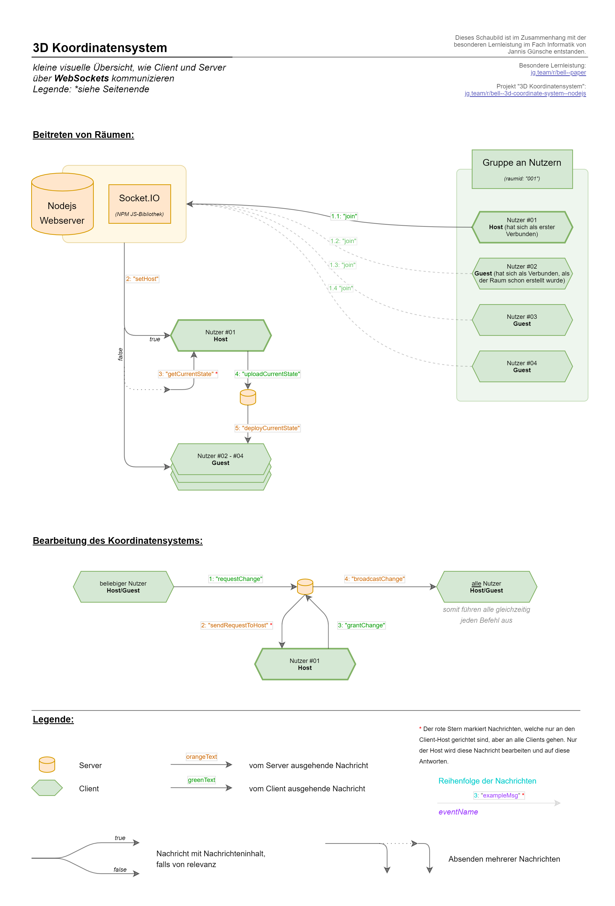

# 3D Koordinatensystem (Stack: Node.js)

💡 Dieses Repo ist im Zusammenhang mit der [besonderen Lernleistung im Fach Informatik von Jannis Günsche](https://github.com/jgteam/bell--paper) entstanden.

**Zu den Screenshots:**
[Alle Screenshots in der Übersicht](docs/screenshots/overview.md)

## Stack

Es handelt sich hier um eine **MEN**-Stack Applikation.

- M: MariaDB (MySQL, etc) *wurde aus Vereinfachung des Setups nicht benutzt*
- E: Express (NPM-Module)
- N: Nodejs

Weitere Software, welche zum Einsatz kommt:

- mysql (NPM-Module) *wurde aus Vereinfachung des Setups nicht benutzt*
- nodemon (NPM-Module) *aktuell unbenutzt, wurde nur bei der Entwicklung verwendet*
- socket.io (NPM-Module)
- ThreeJS
- ThreeJS: OrbitControls
- ThreeJS: CSS3DRenderer & CSS3DObject
- jQuery

## Installation
```
npm install
```

## Benutzung 
Start server:
```
npm start
``````

## Kompatibilitätshinweis
Diese Webapplikation wurde unter folgenden Bedingungen Entwickelt und ist somit automatisch dafür optimiert:
- Opera Browser
- Viewport von 2520x1309px

💡 Die Performance der 3D-Darstellung kann nach Hardware und Performance-Modus abweichen. Unausreichene Rechenleistung kann dazu führen, dass der *THREE WebGLRenderer* und/oder der *CSS3DRenderer* während der Benutzung abstürzen kann.

Bekannte Probleme:
- Firefox: CSS3D-Elemente werden nicht korrekt dargestellt
- Chrome und Chromium: CSS3D-Elemente verursachen manchmal Grafik-Glitches, welche auch die Darstellung der Browser-Elemente und der Entwicklertools beeinflussen

## Weitere Hinweise

Aktuell ist noch keine Logik implementiert, welche die geöffneten Räume schließt. D.h. auch nach dem vollständigen Verlassen eines Raumes kann dieser nicht mehr benutzt werden, da die Host-Rolle nicht neu vergeben wird.

Die Ordnerstruktur besitzt drei wichtige Ordner: *Base*, *Index* und *API*. *Base* beinhaltet den Kern des Frontends bzw. der Raum-Seite und *Index* die Index-Seite. Unter *API* findet man das stackspezifische Gegenstück für die Implementierung der Websockets, welches auf dem Frontend geladen werden kann. Diese Struktur entstand mit dem Hintergedanken diese Applikation auch in anderen Softwarestacks umzusetzen.

## WebSockets: Visueller Graph

[(PDF) WebSockets-Graph](docs/websockets-graph.pdf)
|
[(PNG) WebSockets-Graph](docs/websockets-graph.png)


